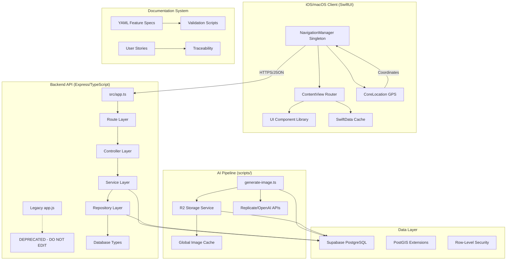

# New Mystica Codebase Architecture Analysis

*Comprehensive analysis of the New Mystica RPG game architecture, patterns, and structure*

**Generated:** 2025-01-02
**Author:** Claude Code Analysis
**Status:** Complete

## Executive Summary

New Mystica is a location-based mobile RPG with AI-generated item imagery, implemented as a monorepo with strict architectural patterns and a sophisticated style inheritance system. The project demonstrates a **dual-codebase migration strategy** where legacy CommonJS code coexists with a modern TypeScript implementation, following clear separation of concerns and comprehensive error handling.

### Key Architectural Characteristics

- **Dual Backend Architecture**: Legacy CommonJS alongside modern TypeScript service layer
- **Style Inheritance System**: Consistent visual theming from enemies → materials → items
- **Global Image Caching**: 20-second blocking AI generation with R2 storage
- **Repository Pattern**: Comprehensive data access layer with ownership validation
- **Singleton Navigation**: SwiftUI app with centralized navigation state management

---

## 1. Architecture Overview

### System Components



### Data Flow Architecture

**Request Lifecycle:**
```
Client Request
  → CORS (app.ts:25)
  → Body Parsing (app.ts:33-34)
  → JWT Auth Middleware (middleware/auth.ts) [adds req.user]
  → Zod Validation (middleware/validate.ts) [adds req.validated]
  → Route Handler (routes/*.ts)
  → Controller (controllers/*.ts)
  → Service Layer (services/*.ts)
  → Repository Layer (repositories/*.ts)
  → Supabase Query
  ← JSON Response
  ← Error Handler (errorHandler.ts) if exception
```

---

## 2. Backend Analysis (mystica-express/)

### Dual Codebase Migration Status

**CRITICAL PATTERN**: The backend exists in a **controlled migration state** with both legacy and modern code:

```
Legacy (DO NOT EDIT):
├── app.js                    # CommonJS Express app
├── routes/*.js              # Basic route definitions
├── bin/www                  # Legacy server startup
└── views/*.jade            # Jade template views

Modern (ACTIVE DEVELOPMENT):
├── src/app.ts              # TypeScript Express app
├── src/routes/*.ts         # Type-safe route handlers
├── src/controllers/*.ts    # Request orchestration
├── src/services/*.ts       # Business logic (mostly NotImplementedError)
├── src/repositories/*.ts   # Data access layer
├── src/middleware/*.ts     # Auth, validation, error handling
└── src/types/*.ts          # Schema definitions and types
```

**Entry Point:** Production uses `dist/server.js` (compiled from `src/server.ts`)

### Service Layer Architecture

**Pattern**: Service → Controller → Route hierarchy with comprehensive error handling

```typescript
// Example: LocationService.ts (FULLY IMPLEMENTED)
export class LocationService {
  async nearby(lat: number, lng: number, radius: number = 5000) {
    // 1. Input validation with custom errors
    if (lat < -90 || lat > 90) {
      throw new ValidationError('Latitude must be between -90 and 90');
    }

    // 2. Repository delegation
    return locationRepository.findNearby(lat, lng, radius);
  }
}
```

**Service Implementation Status:**
- ✅ **LocationService**: Complete implementation with PostGIS queries
- ✅ **AuthService**: Complete with device + email authentication
- ❌ **Most Others**: Throw `NotImplementedError` (skeleton implementations)

### Repository Pattern Implementation

**Pattern**: Ownership validation + optimized queries + N+1 prevention

```typescript
// Example: ItemRepository.test.ts shows comprehensive testing approach
describe('ItemRepository', () => {
  // 1. Basic CRUD with ownership validation
  describe('findById', () => {
    it('should find item by ID with user validation', async () => {
      // Repository enforces ownership: .eq('user_id', userId)
    });
  });

  // 2. Complex queries prevent N+1 problems
  describe('findWithMaterials', () => {
    it('should find item with complete material details using single query', async () => {
      const expectedQuery = `
        id, user_id, item_type_id, level,
        itemtypes (id, name, category, base_stats_normalized),
        itemmaterials (
          slot_index, applied_at,
          materialinstances (
            id, material_id, style_id,
            materials (id, name, description, stat_modifiers)
          )
        )
      `;
      // Single query loads entire object graph
    });
  });
});
```

### Middleware Architecture

**Auth Middleware** (`src/middleware/auth.ts`):
- **Dual Token Support**: Custom anonymous JWT + Supabase email JWT
- **Fast Validation**: `getClaims()` with cached JWKS (5-15ms vs 100-500ms)
- **Type Extensions**: Adds `req.user` with TypeScript definitions

```typescript
// Express type extensions (src/types/express.d.ts)
declare global {
  namespace Express {
    interface Request {
      user?: {
        id: string;
        email: string | null;
        device_id: string | null;
        account_type: 'email' | 'anonymous';
      };
      validated?: any; // From Zod validation middleware
      context?: any;   // For request tracing
    }
  }
}
```

**Validation Middleware** (`src/middleware/validate.ts`):
- **Zod Schema Enforcement**: All requests validated against `src/types/schemas.ts`
- **Type Safety**: Adds `req.validated` with inferred types

### API Architecture Patterns

**Route Structure** (`src/routes/*.ts`):
```typescript
// All routes prefixed /api/v1 (app.ts:58)
app.use('/api/v1', apiRoutes);

// Equipment slots hardcoded (schemas.ts:11-13)
export const EquipmentSlotSchema = z.enum([
  'weapon', 'offhand', 'head', 'armor', 'feet',
  'accessory_1', 'accessory_2', 'pet'
]);

// Material limits enforced (F-04 spec)
export const ApplyMaterialSchema = z.object({
  slot_index: z.number().int().min(0).max(2) // Max 3 materials
});
```

### Testing Patterns

**Jest Configuration** (`jest.config.js`):
- **Module Resolution**: Strips `.js` extensions via `moduleNameMapper`
- **Mock Strategy**: Global Supabase client mocking in `tests/setup.ts`
- **Test Environment**: Node.js (not jsdom) for API testing

```typescript
// Comprehensive test structure (tests/unit/repositories/ItemRepository.test.ts)
describe('ItemRepository', () => {
  // 1. Mock setup with helper functions
  beforeEach(() => {
    mockClient = createMockSupabaseClient();
    repository = new ItemRepository(mockClient);
  });

  // 2. Grouped test scenarios
  describe('Basic CRUD Operations', () => {
    describe('Complex Query Operations (N+1 Prevention)', () => {
      describe('Level & Stats Management', () => {
        describe('History Tracking', () => {
          // Tests cover: ownership validation, error handling,
          // query optimization, batch operations
        });
      });
    });
  });
});
```

### Error Handling Architecture

**Custom Error Classes** (`src/utils/errors.ts`):
```typescript
export class NotFoundError extends Error {
  public statusCode = 404;
  public code = 'NOT_FOUND';
}

export class ValidationError extends Error {
  public statusCode = 400;
  public code = 'VALIDATION_ERROR';
}

// Global error handler (app.ts:81-95)
app.use((error: any, req: Request, res: Response, next: NextFunction) => {
  const isDevelopment = process.env.NODE_ENV === 'development';
  res.status(error.statusCode || 500).json({
    error: {
      code: error.code || 'INTERNAL_ERROR',
      message: error.message,
      ...(isDevelopment && { stack: error.stack })
    }
  });
});
```

---

## 3. Frontend Analysis (New-Mystica/)

### Navigation Architecture

**Singleton NavigationManager** (`NavigationManager.swift`):
```swift
@MainActor
class NavigationManager: ObservableObject {
    @Published var navigationPath = NavigationPath()
    @Published var currentDestination: NavigationDestination = .mainMenu
    @Published var viewHistory: [NavigationDestination] = [.mainMenu]

    private let maxHistorySize = 10

    // CRITICAL: Only one instance via environment injection
    // New_MysticaApp.swift:31-32 creates singleton
    // ContentView:13 consumes with @EnvironmentObject
}
```

**Navigation Flow**:
1. Add case to `NavigationDestination` enum (lines 12-21)
2. Add case to `ContentView.destinationView()` switch (lines 28-67)
3. Use `navigationManager.navigateTo(.destination)`

**History Management Bug**: Adding to history happens BEFORE navigation (line 65), not after

### Design System Enforcement

**Component Library** (`UI/Components/`):
```swift
// Locked color palette (UI/Colors/Colors.swift)
static let mysticaDarkBrown = Color(red: 0.4, green: 0.2, blue: 0.1)
static let mysticaLightBrown = Color(red: 0.8, green: 0.6, blue: 0.4)

// Required font usage (ButtonComponents.swift:72)
.font(.custom("Impact", size: 18)) // All buttons use Impact

// Component patterns - NEVER use raw Text/Button
TitleText("Profile")     // Instead of Text("Profile")
IconButton("⚙️") { }     // Instead of Button { }
```

**Preview Requirements**: ALL SwiftUI previews MUST include:
```swift
#Preview {
    ContentView()
        .modelContainer(for: Item.self, inMemory: true)
        .environmentObject(NavigationManager())
}
```

### SwiftData Integration

**Model Container** (`ContentView.swift:23`):
```swift
.modelContainer(for: Item.self) // Persistent storage automatic
@Query private var items: [Item] // SwiftData query
```

**External Dependencies**:
- **Google Maps SDK**: Required for F-01 Geolocation
- **CoreLocation**: Native GPS tracking
- **Installation Note**: Add via Swift Package Manager

---

## 4. AI Pipeline (scripts/)

### Image Generation Architecture

**Main Pipeline** (`generate-image.ts`):
```typescript
// 1. R2 dependency checking
const itemExists = await checkR2AssetExists(itemType, 'item');
const materialUrls = await getMultipleAssetUrls(materials, 'material');

// 2. Parallel missing asset generation
const generationTasks: Promise<any>[] = [];
if (!itemExists) {
  generationTasks.push(generateRawImage({ name: itemType, type: 'item' }));
}

// 3. Final composite with references
const referenceImages = [itemUrl, ...materialUrls.values()];
const imageBase64 = await generateImageWithReplicate(provider, {
  itemName, itemDescription, referenceImages
});
```

**Provider Models**:
- `gemini` → `google/nano-banana` (Gemini 2.5 Flash)
- `seedream-4` → `bytedance/seedream-4`

**R2 Storage Service** (`r2-service.ts`):
```typescript
// Deterministic naming (line 51-53)
function normalizeNameForR2(name: string): string {
  return name.toLowerCase()
    .replace(/\s+/g, '_')
    .replace(/[^a-z0-9_]/g, '');
}

// Directory structure
// items/{snake_case_name}.png
// materials/{snake_case_name}.png
// monsters/{snake_case_name}.png
// image-refs/{original_filename}.png (10 hardcoded style refs)
```

### Material Application Flow (F-04)

**Critical Pattern**: 20-second **BLOCKING** generation for MVP:
```typescript
// MaterialService workflow (from system-design.yaml:182-196)
1. Check MaterialStacks for (user_id, material_id, style_id) availability
2. Decrement stack quantity (throw if insufficient)
3. Create MaterialInstance from stack material
4. Insert into ItemMaterials with slot_index (0-2)
5. Compute combo_hash = hash(item_type_id + sorted material_ids + style_ids)
6. Check ItemImageCache for existing combo
7a. Cache HIT: use image_url, increment craft_count
7b. Cache MISS: **20s SYNC generation**, upload R2, create cache row
8. Set item.is_styled=true if ANY material.style_id != 'normal'
9. Return image URL from cache
```

---

## 5. Documentation System (docs/)

### YAML-Based Architecture

**Feature Specification Structure**:
```yaml
# docs/feature-specs/F-04-materials-system.yaml
title: Technical Specification - Materials System
feature_id: F-04
status: planned
summary: "Zero-sum trade-offs, max 3 materials, global image cache"

functional_overview:
  core_logic: "MaterialStacks → MaterialInstances → ItemMaterials"
  api_endpoints: ["/materials", "/materials/inventory", "/items/{id}/materials/apply"]

implementation_status:
  progress: 40  # Database complete, services stubbed
  blocked_items: []
```

**Validation System**:
```bash
# docs/check-project.sh validates:
./docs/check-project.sh -v
- YAML syntax and schema compliance
- Feature ID uniqueness (F-01, F-02, etc.)
- User story traceability (US-101 → F-04)
- API contract consistency
```

### Style System Architecture (F-05)

**Style Inheritance Flow**:
```yaml
# system-design.yaml:238-247
1. Enemy spawns with style_id from EnemyTypes table
2. Combat victory → materials drop with enemy's style_id
3. MaterialStacks keyed by (user_id, material_id, style_id)
4. Player applies styled material → MaterialInstances.style_id
5. item.is_styled = (ANY applied material has style_id != 'normal')
6. Image generation includes all style_ids in combo_hash
7. Generated item displays combined visual effects
```

---

## 6. Database Schema Architecture

### Migration Pattern

**Initial Schema** (`mystica-express/migrations/001_initial_schema.sql`):
```sql
-- Comprehensive 38K line migration with:
-- 5 enums: rarity, combat_result, actor, weapon_pattern, hit_band
-- PostGIS extensions for geospatial queries
-- Complex constraints and relationships

CREATE TYPE rarity AS ENUM ('common', 'uncommon', 'rare', 'epic', 'legendary');

CREATE TABLE Users (
    id UUID PRIMARY KEY,
    email VARCHAR UNIQUE NOT NULL,
    gold_balance INT NOT NULL DEFAULT 500, -- DEPRECATED: use UserCurrencyBalances
    vanity_level INT NOT NULL DEFAULT 0
);
```

**Critical Schema Patterns**:

1. **Equipment Architecture**: `UserEquipment` table = single source of truth
2. **Material Stacking**: `MaterialStacks` composite PK `(user_id, material_id, style_id)`
3. **Global Image Cache**: `ItemImageCache` NOT user-scoped, tracks `craft_count`
4. **Style Inheritance**: `StyleDefinitions` with spawn rates, inherited to materials

### Environment Configuration

**Required Variables** (`.env.local`):
```bash
# Supabase (validated on startup)
SUPABASE_URL=https://xxx.supabase.co
SUPABASE_ANON_KEY=...
SUPABASE_SERVICE_ROLE_KEY=...

# R2 Storage
CLOUDFLARE_ACCOUNT_ID=...
R2_ACCESS_KEY_ID=...
R2_SECRET_ACCESS_KEY=...

# AI Services
REPLICATE_API_TOKEN=...
OPENAI_API_KEY=...
```

**Validation**: `src/config/env.ts` uses Zod schema, throws detailed errors if missing

---

## 7. Key Patterns and Conventions

### Code Organization

```
monorepo/
├── mystica-express/          # Backend (TypeScript migration)
│   ├── src/                 # NEW: TypeScript implementation
│   ├── app.js               # LEGACY: Do not edit
│   ├── package.json         # pnpm scripts, Jest config
│   └── tests/               # Unit tests with Supabase mocks
├── New-Mystica/             # SwiftUI iOS/macOS app
│   ├── UI/Components/       # Design system components
│   ├── NavigationManager.swift  # Singleton navigation
│   └── ContentView.swift    # Router with destination switch
├── scripts/                 # AI image generation pipeline
│   ├── generate-image.ts    # Main pipeline with R2 integration
│   ├── r2-service.ts        # AWS S3 SDK wrapper
│   └── package.json         # Separate pnpm workspace
└── docs/                    # YAML documentation system
    ├── feature-specs/       # F-01, F-02, etc.
    ├── user-stories/        # US-101, US-102, etc.
    └── check-project.sh     # Validation scripts
```

### Naming Conventions

**Backend TypeScript**:
- **Files**: PascalCase (`LocationService.ts`, `ItemRepository.ts`)
- **Classes**: PascalCase (`class LocationService`)
- **Methods**: camelCase (`async nearby()`)
- **Constants**: UPPER_SNAKE_CASE (`MAX_MATERIALS = 3`)

**Frontend SwiftUI**:
- **Files**: PascalCase (`NavigationManager.swift`)
- **Views**: PascalCase (`struct ContentView`)
- **Properties**: camelCase (`@Published var currentDestination`)
- **Enums**: PascalCase (`enum NavigationDestination`)

**Database**:
- **Tables**: PascalCase (`Users`, `ItemTypes`, `MaterialStacks`)
- **Columns**: snake_case (`user_id`, `created_at`, `material_combo_hash`)
- **Enums**: lowercase (`'common'`, `'victory'`, `'weapon'`)

**Documentation**:
- **Feature IDs**: `F-01` (zero-padded)
- **User Stories**: `US-101` (three digits)
- **Files**: kebab-case (`materials-system.yaml`)

### Error Handling Approaches

**Backend**: Custom error classes with HTTP status codes
```typescript
throw new ValidationError('Latitude must be between -90 and 90');
throw new NotFoundError('Item', itemId);
throw new BusinessLogicError('Material limit exceeded');
```

**Frontend**: SwiftUI error boundaries with user-friendly messages
```swift
// Design system provides error states
PopupView(message: "Failed to load items", isError: true)
```

**AI Pipeline**: Fail-fast with detailed error context
```typescript
if (!apiToken) {
  throw new Error('REPLICATE_API_TOKEN not found in .env.local');
}
```

### Type Safety Practices

**Backend**: Strict TypeScript with database-generated types
```typescript
// src/types/database.types.ts (auto-generated)
type Location = Database['public']['Tables']['locations']['Row'];

// src/types/schemas.ts (Zod validation)
export const ApplyMaterialSchema = z.object({
  material_id: z.string().min(1),
  slot_index: z.number().int().min(0).max(2)
});
```

**Frontend**: SwiftUI with SwiftData type safety
```swift
@Query private var items: [Item]  // SwiftData provides type safety
@EnvironmentObject private var navigationManager: NavigationManager
```

### Testing Strategies

**Backend Tests** (`tests/unit/`):
- **Repository Layer**: Comprehensive CRUD + ownership validation
- **Service Layer**: Business logic + error handling
- **Middleware**: Auth + validation + error boundary
- **Mock Strategy**: Global Supabase client mocking

**Frontend Tests**:
- **Preview Testing**: All components must have working previews
- **Navigation Testing**: Manual testing with NavigationManager state

---

## 8. Critical Files and Entry Points

### Main Application Entry Points

**Backend Production**:
```
pnpm start → dist/server.js (compiled from src/server.ts)
```

**Backend Development**:
```
pnpm dev → tsx src/server.ts (with nodemon hot reload)
```

**Frontend**:
```
New-Mystica.xcodeproj → ⌘R in Xcode
```

**AI Pipeline**:
```bash
cd scripts && pnpm generate-image --type "Magic Wand" --materials "wood,crystal"
```

### Key Configuration Files

| File | Purpose | Critical Settings |
|------|---------|------------------|
| `mystica-express/package.json` | Backend dependencies | `"dev": "lsof -ti:3000 | xargs kill -9"` kills port 3000 |
| `mystica-express/tsconfig.json` | TypeScript config | `"module": "commonjs"` but imports use `.js` |
| `mystica-express/jest.config.js` | Test configuration | `moduleNameMapper` strips `.js` extensions |
| `New-Mystica/Info.plist` | iOS permissions | `NSLocationWhenInUseUsageDescription` for GPS |
| `scripts/package.json` | AI pipeline deps | Separate pnpm workspace |
| `.env.local` | Environment vars | Required for all services (validated on startup) |

### Important Service Implementations

**Fully Implemented Services**:
- `src/services/LocationService.ts` - PostGIS geospatial queries
- `src/services/AuthService.ts` - Device + email authentication

**Key Repository Files**:
- `src/repositories/ItemRepository.ts` - Comprehensive item CRUD
- `src/repositories/LocationRepository.ts` - Geospatial + combat pools

**Core Data Models**:
- `src/types/database.types.ts` - Auto-generated from Supabase
- `src/types/schemas.ts` - Zod validation schemas
- `src/types/express.d.ts` - Request type extensions

### SwiftUI Core Files

**Navigation System**:
- `NavigationManager.swift` - Singleton navigation state (CRITICAL)
- `ContentView.swift` - Router with destination switching
- `New_MysticaApp.swift` - App entry point + environment setup

**UI Component Library**:
- `UI/Components/TextComponents.swift` - TitleText, NormalText
- `UI/Components/ButtonComponents.swift` - IconButton, TextButton
- `UI/Colors/Colors.swift` - Locked color palette

---

## 9. Current State Assessment

### Migration Status (Backend)

**Legacy → TypeScript Migration**: ~60% Complete
- ✅ **Infrastructure**: App setup, middleware, routes, types
- ✅ **Core Services**: LocationService, AuthService
- ❌ **Most Services**: Throw `NotImplementedError`
- ❌ **Integration**: Service layer not connected to controllers

**Blocked Items** (from F-04 spec):
```yaml
blocked_items:
  - code: "MISSING_MATERIAL_LIBRARY_ENDPOINT"
    description: "GET /materials endpoint defined but no implementation"
  - code: "IMAGE_GENERATION_NOT_INTEGRATED"
    description: "ImageGenerationService exists but not connected to material workflow"
```

### MVP0 Scope and Limitations

**Design Constraints** (from ai-docs):
- **Blocking Generation**: 20s sync wait (vs async with crafting times later)
- **Drop Rates**: 100% drop rates for testing
- **Weapon Patterns**: Only `single_arc` supported
- **Material Limits**: 1-3 materials hardcoded
- **Sync Blocking**: UI must handle 20s generation wait

### Technical Debt

**Backend**:
- Auth middleware uses `null as unknown as SupabaseClient` (auth.ts:44)
- Error classes duplicated in `errorHandler.ts` vs `utils/errors.ts`
- Most services throw `NotImplementedError`
- `.js` import extensions confuse developers

**Frontend**:
- Navigation history bug: adding BEFORE navigation (line 65)
- Multiple NavigationManager instances would break state
- Preview crashes without specific dependencies

**AI Pipeline**:
- 10 hardcoded reference image URLs (not parameterized)
- R2 dependency order matters (check before generate)
- 20s blocking generation affects UX

### Database State

**Applied Migrations**:
- ✅ `001_initial_schema.sql` - 38K comprehensive schema
- ✅ Location seed data - 30 SF locations for testing
- ✅ PostGIS RPC functions - `get_nearby_locations`

**Data Consistency**:
- **Users.gold_balance**: Marked DEPRECATED, use `UserCurrencyBalances`
- **MaterialStacks**: Style inheritance via composite key working
- **ItemImageCache**: Global caching operational

---

## 10. Architectural Strengths

### 1. **Controlled Migration Strategy**
- Legacy and modern code clearly separated
- No breaking changes during transition
- Clear "DO NOT EDIT" boundaries

### 2. **Comprehensive Type Safety**
- Database-generated TypeScript types
- Zod schema validation for all requests
- SwiftUI type safety with SwiftData

### 3. **Sophisticated Style System**
- End-to-end style inheritance (enemies → materials → items)
- Global image caching with craft count tracking
- Deterministic combo hashing for cache hits

### 4. **Repository Pattern Implementation**
- Ownership validation at data layer
- N+1 query prevention with complex joins
- Comprehensive error handling

### 5. **Singleton Navigation**
- Centralized state management in SwiftUI
- Consistent navigation patterns
- Environment-based dependency injection

### 6. **YAML Documentation System**
- Machine-readable feature specifications
- Automated validation and traceability
- API contract consistency checking

---

## 11. Recommendations for Future Development

### Immediate Priorities

1. **Complete Service Implementation**: Replace `NotImplementedError` with actual business logic
2. **Connect Service Layer**: Wire services to controllers and routes
3. **Fix Navigation Bug**: Move history addition AFTER navigation

### Architecture Improvements

1. **Async Image Generation**: Replace 20s blocking with job queue system
2. **Service Discovery**: Remove hardcoded reference image URLs
3. **Error Boundary Enhancement**: Add structured error codes and recovery
4. **Test Coverage**: Add integration tests for service → repository chains

### Scalability Considerations

1. **Repository Optimization**: Add query result caching for expensive operations
2. **Image Pipeline**: Implement background job processing for generation
3. **Database Indexes**: Add performance indexes for combat pool queries
4. **Client Caching**: Expand SwiftData caching for offline resilience

---

## Conclusion

New Mystica demonstrates sophisticated architectural patterns with a well-planned migration strategy and innovative style inheritance system. The codebase shows strong separation of concerns, comprehensive error handling, and thoughtful abstraction layers.

The **dual-codebase approach** provides a safe migration path while maintaining system stability. The **style inheritance system** creates visual consistency across the entire game experience. The **comprehensive documentation system** ensures maintainability and traceability.

Key areas for immediate attention are completing the service layer implementation and resolving the identified schema mismatches. The foundation is solid and ready for rapid feature development once the migration is completed.

**Pattern to Follow**: Study `LocationService.ts` and `AuthService.ts` as exemplars for implementing remaining services with proper error handling, validation, and repository delegation.